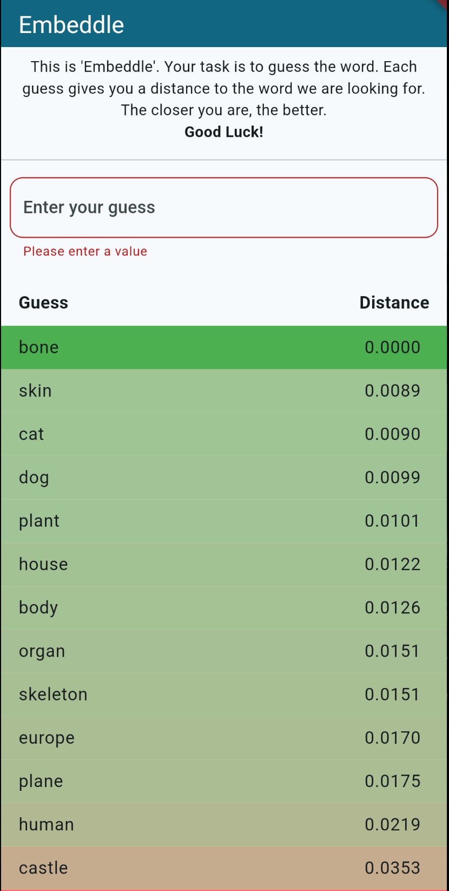
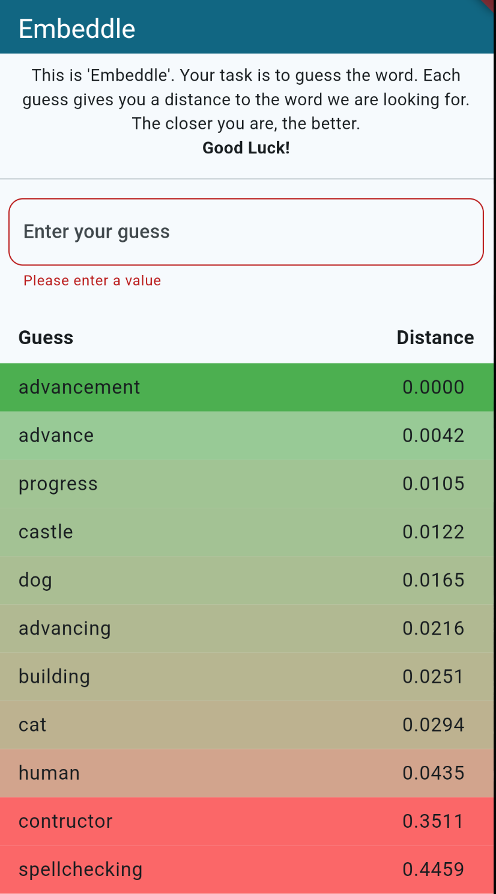

# Embeddle

This is a simple flutter app (my first flitter app) implementing a simple guessing game. This was heavily inspired by 'Contexto', but its worse.  
The Idea is simple: Generate a random secret word and try to guess it. Your hints are the distances of other words to the secret word, measured using the cosinus-distance between embeddings of the words.

In theory, this should allow you to navigate through the dictionary to find what you want.

## Example 1 - The secret word were `bone` and `advancement`

    
    

